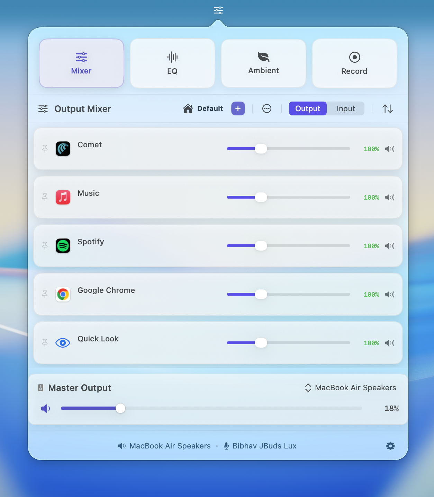
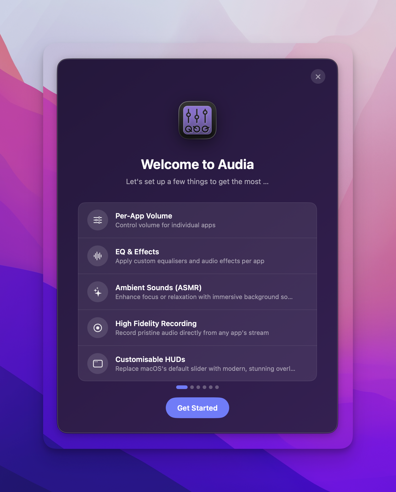
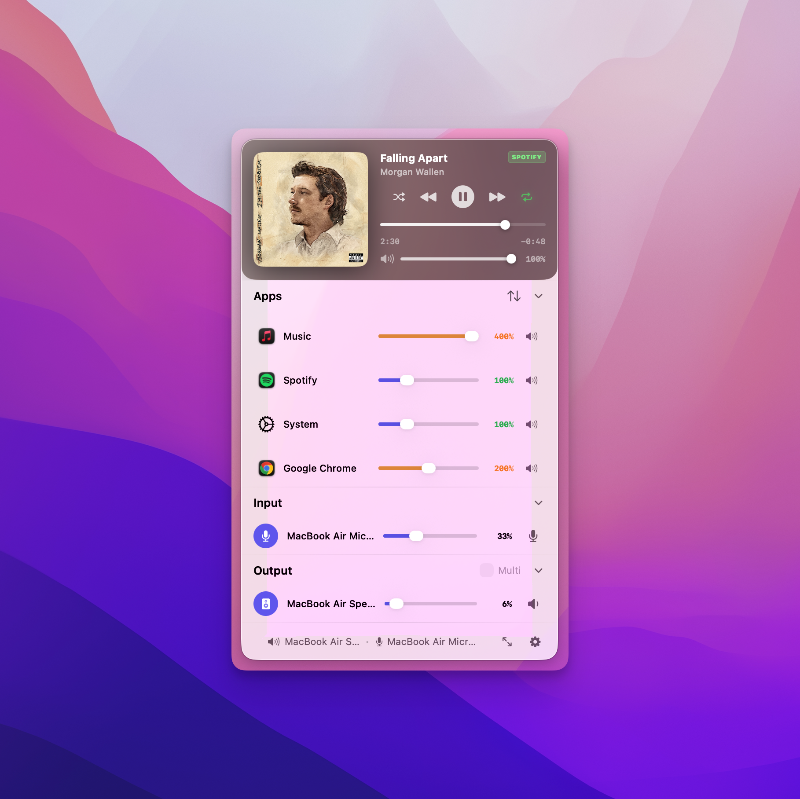
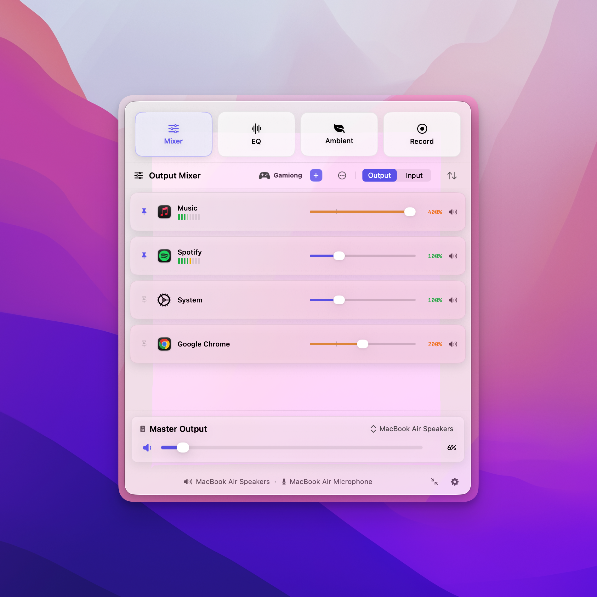
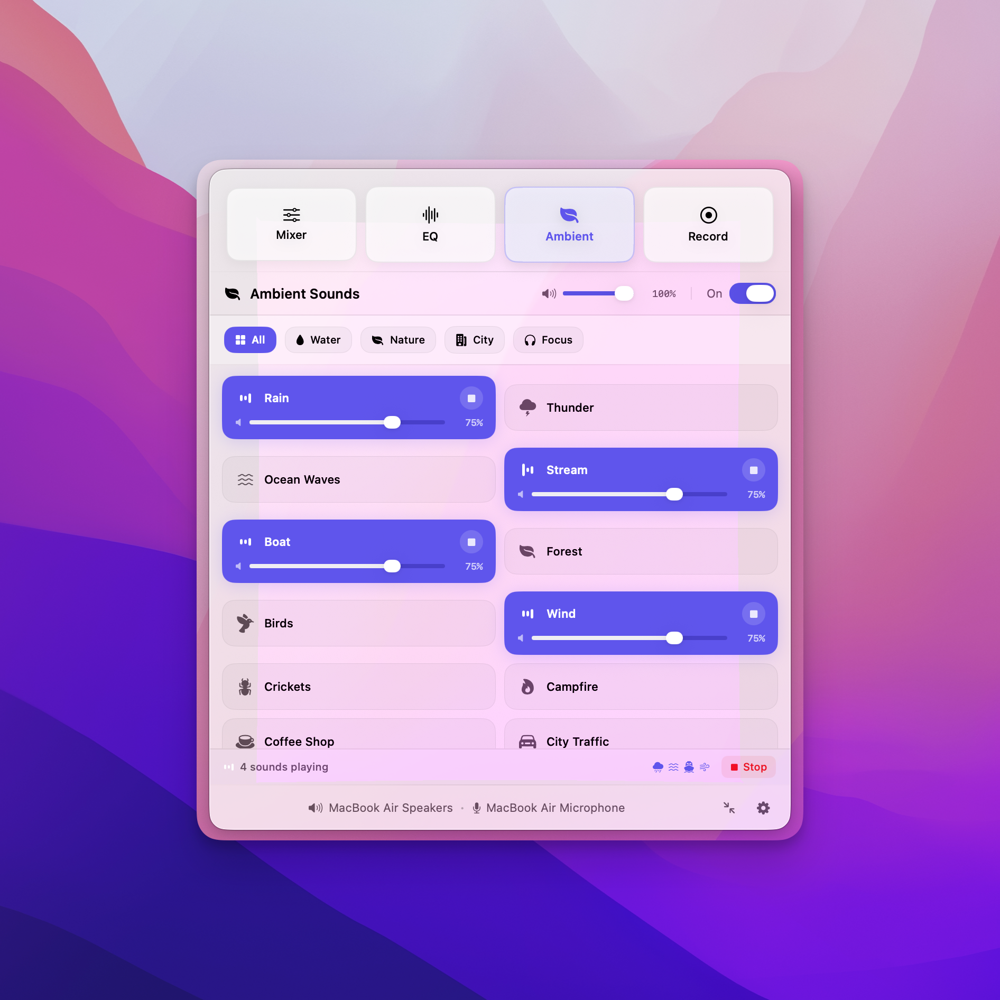
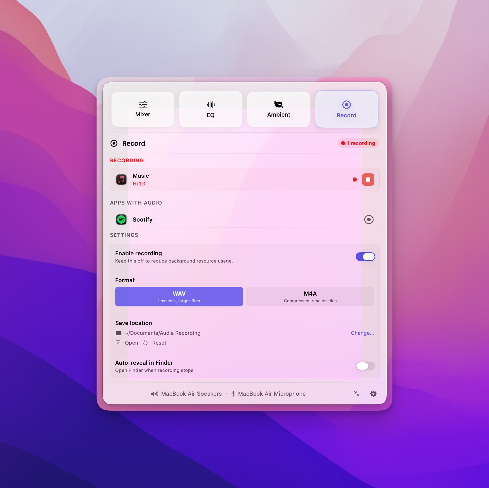
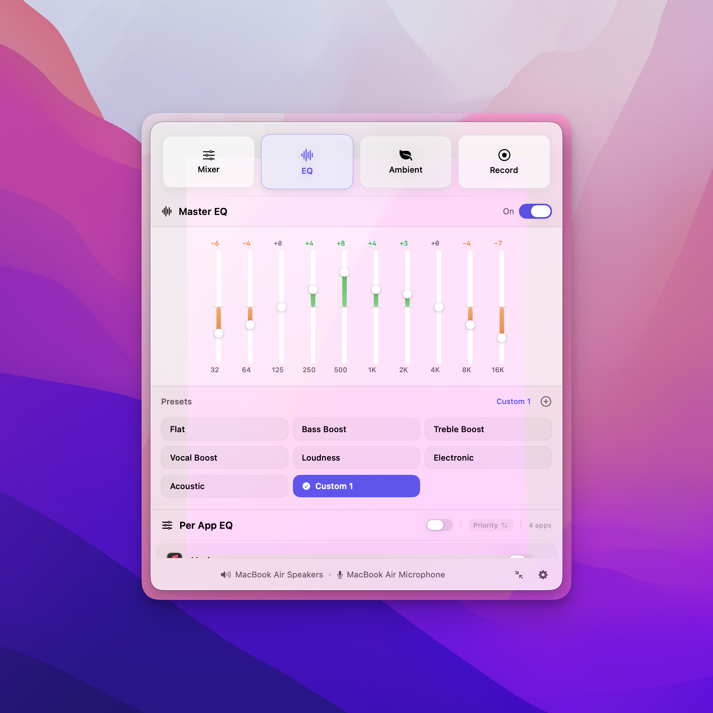

<h3>Audia</h3>

MacOS gives you one system-wide volume slider. No per-app control, no proper routing, no deep EQ workflow. If you want full audio control today, you usually end up stacking multiple disjointed software tools.

Audia is built to change that. It is a single, beautifully native macOS app that handles your entire audio workflow cleanly. Control the volume of every app (and even individual browser tabs) independently, route audio to multiple speakers with smooth crossfades, shape your sound with an advanced 10-band EQ, and record isolated app audio natively.

It completely replaces the stock Apple volume overlay with a customizable "Liquid Glass" HUD, living quietly in your menu bar. Built with native Swift for low-latency performance. One app. One menu bar icon.

 

  
  
  
  
  

  

## Install

**Manual** — [Download latest release](https://github.com/Bibhav48/audia-dist/releases/latest)

> **First-run note (macOS Gatekeeper):** We are in Beta and are not notarized yet, so macOS may warn that Audia is from an unidentified developer. If that happens:
>
> 1. Double-click Audia in your Applications folder.
> 2. When the warning appears, click **OK**.
> 3. Open **System Settings** > **Privacy & Security**.
> 4. Scroll down, locate the message that Audia was blocked from use, and click **Open Anyway**.

## Quick Start

1. Install Audia and launch it from your Applications folder.
2. Grant necessary **macOS System Permissions** when prompted. Per‑app routing and isolated recording require these permissions.
3. Click the Audia icon in your menu bar to start taking control of your audio.

## Features

### 🎚 Audio Control & Routing

- **Per-app volume mixer** — Individual sliders for every app. Mute, boost beyond 100%, pan left or right per app, and monitor live levels with real-time meters.
- **Browser tab audio control** — Control individual tabs in major browsers like Chrome, Arc, Safari, Brave, Edge, Vivaldi, and more.
- **Multi-device routing & crossfades** — Route any app to multiple outputs simultaneously. Smooth equal-power crossfades prevent abrupt pops/cuts when switching outputs.
- **Input & mic controls** — Manage default input switching, input gain/mute, pinning, and dedicated microphone shortcuts.
- **Profiles & snapshots** — Save complete states (volume, pan, EQ, routing) and switch them instantly based on context.

### 🖥 Interface & HUD

- **Custom Head-Up Display (HUD)** — Replaces the stock macOS volume overlay. Choose from 6 styles (Modern Pill, Slim, Classic, Two-Tone, Glass Bar, Compact). Supports 8 screen positions and device-aware icons.
- **Now Playing mini-player** — A glass-style popover with album art, playback controls, and tracking for Spotify and Apple Music.
- **Menu customization** — Swap between compact and advanced panel modes, reorder layout sections, and set custom menu positions.

### 🎛 EQ & Soundscapes

- **10-band EQ** — 32 Hz to 16 kHz with built-in presets, custom presets, and specific per-app EQ profiles.
- **Ambient soundscapes** — 20 built-in sounds (rain, ocean, campfire, white/pink noise, etc.) with independent mixing.

### 🎙 Advanced Capabilities

- **Isolated per-app recording** — Capture audio from specific apps cleanly, including parallel recordings to separate WAV or M4A files.
- **Per-app keyboard shortcuts** — Control app-specific volume (up/down/mute) globally without opening the app window.
- **Automation** — Extensive App Intents support for Apple Shortcuts (volume, mute, EQ, routing, recording, profiles, and device control).

## How Audia Compares

| Feature                        | Audia | FineTune | BetterAudio  | SoundSource | Loopback + Audio Hijack |
| :----------------------------- | :---- | :------- | :----------- | :---------- | :---------------------- |
| **Per-app volume + EQ**        | ✅    | ✅       | ✅           | ✅          | Partial                 |
| **Audio routing**              | ✅    | ✅       | ✅           | ✅          | ✅ (Loopback)           |
| **Multi-device routing**       | ✅    | ✅       | ✅           | ❌          | ✅ (Loopback)           |
| **Crossfade switching**        | ✅    | ❌       | ❌           | ❌          | ❌                      |
| **Per-app recording**          | ✅    | ❌       | ❌           | ❌          | ✅ (Audio Hijack)       |
| **Ambient soundscapes**        | ✅    | ❌       | ❌           | ❌          | ❌                      |
| **Custom HUD (6 styles)**      | ✅    | ❌       | ✅           | ❌          | ❌                      |
| **Now Playing mini-player**    | ✅    | ❌       | ✅           | ❌          | ❌                      |
| **Per-app shortcuts**          | ✅    | ❌       | ✅           | ❌          | ❌                      |
| **Browser tab audio control**  | ✅    | ❌       | ❌           | ❌          | ❌                      |
| **Full workflow profiles**     | ✅    | ❌       | ❌           | ❌          | ❌                      |
| **Per-app panning**            | ✅    | ❌       | ✅           | ✅          | ❌                      |
| **Compact mini-view layout**   | ✅    | ❌       | Only Compact | ❌          | ❌                      |
| **Native Swift + lightweight** | ✅    | ✅       | ✅           | ❌          | ❌                      |

## Screenshots

  
  

  
  

  
  

## Status & Pricing

Audia is in active development and follows a **freemium** model. The current beta includes a **free trial** for all users so you can fully evaluate the app. Post-launch, the core features you rely on will always stay free, with an optional paid license planned only for advanced workflows.

## Feedback & Bugs

This repository serves as the public hub for releases and issue tracking. If you test Audia and share useful bug reports or reproducible feedback, we read everything! Please [open a new issue](https://github.com/Bibhav48/audia-dist/issues).

When reporting, please include:

- macOS version
- Audia version
- Steps to reproduce the issue
